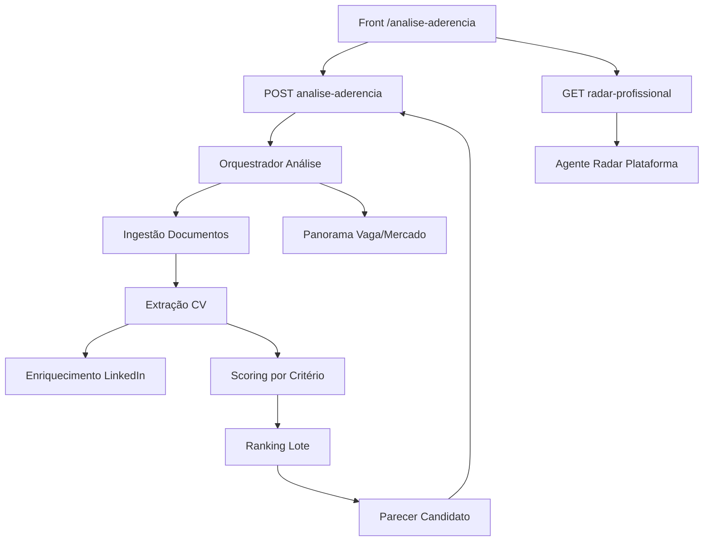

# Análise de aderência – Documentação Técnica (Regras de Negócio e Backend)

Documentação **multi-audiência** do protótipo **Análise de aderência** no hub Fourmakers: triagem inicial de candidatos com IA, panorama de vaga/mercado, ranking de aderência, parecer por critérios, **Radar profissional** e ranking pocket flutuante.

**Criado em:** 27/05/2026  
**Última atualização:** 02/06/2026 — backlog de agentes e skills (time IA): ingestão CV, scoring, parecer e radar; contratos I/O e priorização P0–P2.

**Estado:** protótipo front com mocks; integração API .NET 8 **pendente**.

---

## §0. Como usar este documento (mapa de audiências)

| Audiência | Secções prioritárias | Uso |
|-----------|---------------------|-----|
| **Recrutador / treinamento** | §1–§3, §5, §9 (FAQ) | Onboarding e operação da triagem |
| **Negócio / PO** | §1, §4, Bloco A §2 e §5 | Regras, jornada, aceite |
| **Frontend** | §6, §7, §8, §13 | Implementação no hub de protótipos |
| **Backend .NET 8** | Bloco A §10–§11, §7, **Sugestões para integração** | Contratos, envelope, DTOs |
| **QA** | §8, §9 | Casos manuais e `data-testid` futuros |
| **UX / Design** | §5 | DS, layout duas colunas, drawer |
| **IA (RAG)** | §10 | Chunks e sinónimos |
| **Time IA / Agentes** | **§14**, §7, Sugestões integração | Backlog de agentes, skills, I/O estruturado |

---

## §1. Visão geral e objetivo

### 1.1 Produto

| Item | Descrição |
|------|-----------|
| **Rota (protótipo)** | `/analise-aderencia` |
| **Registo hub** | `id: analise-aderencia` em `src/prototipo/registry.ts` |
| **Título na UI** | Análise de aderência |
| **Descrição (card)** | Triagem com IA: upload de CV/ZIP/LinkedIn, panorama da vaga, ranking e parecer visual (radar, critérios, PDI e trajetória). |
| **Persona** | Recrutador / analista de R&S |
| **Objetivo de negócio** | Substituir fluxo manual (CV → ferramenta externa → parecer) por experiência integrada: contexto de mercado, ordenação por aderência, parecer estruturado e radar do candidato na plataforma para decisão de contratação e indicações. |

### 1.2 Objetivos principais (visão de produto)

- Centralizar entrada de candidatos (arquivo, lote, ZIP, LinkedIn) numa única vaga.
- Gerar **panorama** da vaga e do mercado para contextualizar a triagem.
- Ordenar candidatos por **% de aderência** com ranking visual (até 10+ perfis por lote no protótipo).
- Entregar **parecer** por candidato: ≥6 critérios alinhados aos desafios da vaga, gráfico radar (0–5), gaps, PDI, complemento IA e trajetória sugerida.
- Expor **Radar profissional** (histórico na plataforma, relações LinkedIn, gamificação, alertas) em drawer lateral.
- Manter **ranking acessível** via coluna sticky e **pocket ranking** flutuante ao rolar o parecer.

---

## §2. Jornada do utilizador

1. Aceder ao hub → card **Análise de aderência** ou rota direta.
2. **Setup:** selecionar vaga (`VAGAS_ANALISE_MOCK`) e anexar candidatos (abas Arquivo / Lote / ZIP / LinkedIn).
3. Clicar **Iniciar análise com IA** (exige vaga + pelo menos um ficheiro ou URL).
4. **Processamento:** 5 etapas simuladas com barra de progresso (`ProcessamentoAnalise`).
5. **Resultados:**
   - Coluna esquerda (2/3): KPIs do lote, panorama, momento/contexto, desafios e insights (secções expansíveis).
   - Coluna direita (1/3): ranking de 10 candidatos (cards compactos, sticky, sem scroll interno).
   - Ao rolar para o **parecer**, se o ranking sair do viewport → **pocket ranking** (canto inferior direito, colapsável).
6. Selecionar candidato no ranking → **Parecer** (radar Recharts, tabela de critérios, PDI, trajetória).
7. **Radar profissional:** botão no cabeçalho do parecer → drawer à direita com panorama completo do candidato.
8. **Nova análise:** repõe setup e limpa estado.

---

## §3. Funcionalidades detalhadas (checklist de produto)

| Funcionalidade | Comportamento (protótipo) |
|----------------|---------------------------|
| Seletor de vaga | Lista mock `vagasAnalise.ts` (código, título, cliente, desafios, objetivos). |
| Entrada arquivo | Um ou mais ficheiros; lista com remoção. |
| Entrada lote | Múltiplos ficheiros numa seleção. |
| Entrada ZIP | Aceita `.zip`; mock trata como lote. |
| LinkedIn | URLs em lista; validação mínima (não vazio, sem duplicata). |
| Processamento IA | Timer simulado; sem chamada HTTP real. |
| Panorama | Momento + contexto cliente + mercado; desafios/insights em `Collapsible` (abertos por defeito). |
| Ranking | 10 candidatos ordenados por `ranking`; % aderência e selo de potencial. |
| Pocket ranking | `IntersectionObserver`; header com seta expandir/recolher (aberto por defeito). |
| Parecer | ≥6 critérios, nota/maxNota, desafio da vaga, evidência, gap, PDI, complemento IA. |
| Radar profissional | Drawer `Sheet` largo; mocks por `candidatoId` em `radarProfissionalMock.ts`. |
| Nova análise | Volta à fase setup. |

---

## §4. Regras de negócio

### 4.1 Críticas

| Regra | Detalhe |
|-------|---------|
| **Vaga obrigatória** | Não inicia análise sem `vagaId`. |
| **Entrada mínima** | Pelo menos um ficheiro **ou** uma URL LinkedIn (`hasEntradaCandidatos`). |
| **Critérios da vaga** | Cada candidato deve ter critérios derivados dos **desafios** da vaga (protótipo: 6 critérios fixos no mock). |
| **Escala de nota** | 0–5 por critério; aderência geral em % (0–100). |
| **Ranking** | Ordem ascendente por campo `ranking` (1 = melhor aderência no lote). |
| **Potencial** | `alto` \| `medio` \| `em_desenvolvimento` — impacta copy e selo no card. |

### 4.2 Radar profissional (regras de produto sugeridas)

- Dados agregados de **histórico na plataforma**, **LinkedIn** (relações com gestor da vaga), **avaliações** de outras vagas e **gamificação**.
- Alertas e **não recomendações** não bloqueiam inscrição no protótipo; na produção, backend define severidade e bloqueios (`gamificacao.bloqueios`).
- Ações **Indicar para vaga** / **Favoritar** são UI-only no protótipo.

---

## §5. UX, UI e Design System

- **Layout resultados:** grid `2fr / 1fr` (contexto : ranking); `max-w-7xl` na fase resultados.
- **Tokens e componentes:** `Button`, `Card`, `Badge`, `Select`, `Tabs`, `Sheet`, `Collapsible`, `Progress` de `src/components/ui`; estilos em `analiseAderencia.css` (`analise-brand-gradient`, `analise-glass`, `analise-glow-card`).
- **Sem cores cruas:** usar tokens (`primaryText`, `accent`, `borderSoft`, etc.) — ver `public/design-toolkit.md`.
- **Acessibilidade:** `aria-label` no pocket ranking; `aria-expanded` no header colapsável; `SheetTitle`/`SheetDescription` no drawer; botões com `type="button"`.
- **Estados:** loading no processamento; vazio desabilita CTA; erro de API **não implementado** (próximo passo).

---

## §6. Arquitetura frontend (protótipo)

```
src/prototipo/registry.ts
  └── AnaliseAderenciaPage.tsx
        ├── EntradaCandidatosPanel (+ EntradaCandidatosState)
        ├── ProcessamentoAnalise
        └── ResultadosAnaliseLayout
              ├── PanoramaVagaSection
              ├── RankingCandidatos
              ├── RankingPocketFloat
              └── CandidatoDetalhePanel
                    ├── CriterioRadarChart (Recharts)
                    └── RadarProfissionalDrawer
mocks/
  ├── vagasAnalise.ts
  ├── resultadoAnaliseMock.ts  → buildResultadoMock(vagaId)
  └── radarProfissionalMock.ts → getRadarProfissionalMock(candidato)
types.ts
analiseAderencia.css
```

**Próximo passo integração:** camada `httpClient` + use case (padrão fourmakers-v2) substituindo `buildResultadoMock` e polling/websocket no processamento.

---

## §7. Integração backend (consumida ou sugerida)

Ver **Sugestões para integração** (final do documento) para endpoints, JSON com envelope e DTOs C#.

Resumo:

| Método | Path (sugerido) | Uso |
|--------|-----------------|-----|
| GET | `/api/recrutamento/vagas/{vagaId}/contexto-analise` | Desafios + objetivos para UI |
| POST | `/api/analise-aderencia` | Inicia job (multipart + urls) |
| GET | `/api/analise-aderencia/{jobId}` | Status + resultado |
| GET | `/api/recrutamento/candidatos/{candidatoId}/radar-profissional` | Drawer radar |

---

## §8. QA — `data-testid` sugeridos e casos manuais

| `data-testid` | Elemento |
|---------------|----------|
| `analise-vaga-select` | Seletor de vaga |
| `analise-iniciar` | CTA Iniciar análise |
| `analise-ranking-card-{id}` | Card do candidato no ranking |
| `analise-parecer` | Secção parecer |
| `analise-radar-btn` | Botão Radar profissional |
| `analise-pocket-ranking` | Container pocket |
| `analise-pocket-toggle` | Header expandir/recolher pocket |

**Casos manuais:**

1. Iniciar sem vaga ou sem entrada → botão desabilitado.
2. Fluxo completo → 10 candidatos no ranking.
3. Selecionar #3 no ranking → parecer de Pedro Almeida (mock).
4. Abrir Radar profissional → drawer com relações e alertas.
5. Scroll até parecer → pocket visível; colapsar pocket → só header.
6. Nova análise → volta ao setup.

---

## §9. FAQ (ação → pergunta / resposta)

| Ação | Pergunta | Resposta canónica |
|------|----------|-------------------|
| Triagem | Quantos critérios por candidato? | Mínimo 6, alinhados aos desafios da vaga; escala 0–5. |
| Entrada | Posso misturar PDF e LinkedIn? | Sim: ficheiros nas abas arquivo/lote/zip e URLs na aba LinkedIn no mesmo lote. |
| Ranking | Por que 88% e nota 5/5? | % é aderência geral ponderada pela IA; notas são por critério. |
| Pocket | Para que serve o ranking flutuante? | Manter seleção rápida quando o parecer empurra o ranking para fora do ecrã. |
| Radar | De onde vêm relações LinkedIn? | Integração futura; protótipo usa mock (ex.: 1º grau com gestor da vaga). |
| API | A análise é em tempo real? | Produção: job assíncrono; protótipo simula 5 passos. |

---

## §10. Consumo por IA (RAG)

**Chunks recomendados:** jornada setup → processamento → layout 2 colunas → parecer → radar → pocket.

**Sinónimos:** triagem IA, aderência, fit candidato, parecer CV, ranking aderência, radar profissional.

**Limitações:** mocks não refletem SLA real; URLs LinkedIn não são validadas contra API LinkedIn no protótipo.

---

## §11. Stakeholders e métricas (opcional)

| Stakeholder | Interesse |
|-------------|-----------|
| R&S | Reduzir tempo de triagem e padronizar parecer |
| Gestor de vaga | Critérios alinhados aos desafios |
| Plataforma | Indicações cruzadas via radar |

**Métricas sugeridas:** tempo médio triagem, % candidatos com aderência ≥70, uso do radar, cliques em Indicar.

---

## §12. Evoluções e dívidas técnicas

- Integrar APIs reais e estados de erro (4xx/5xx) com envelope.
- Paginação server-side se lote >50 CVs.
- Persistir `jobId` e resultado em URL para partilha.
- `data-testid` nos componentes.
- Upload com limite de tamanho e antivírus (backend).
- Internacionalização PT/EN se necessário.
- Implementar agentes §14 (substituir mocks).

---

## §14. Backlog de agentes e skills (time IA)

Catálogo de agentes para o pipeline de **Análise de aderência**: ingestão de CVs (PDF/ZIP), extração estruturada, scoring por critérios da vaga, ranking, parecer individual e **Radar profissional**. Saídas alinhadas a `ResultadoAnaliseAderencia` e `RadarProfissional` (`types.ts`).

### 14.1 Princípios de arquitetura

| Princípio | Descrição |
|-----------|-----------|
| **Job assíncrono** | `POST` retorna `jobId`; polling `GET …/{jobId}` até `status: completed`. |
| **Pipeline por candidato** | Extração → enriquecimento → scoring → parecer; paralelizável por lote. |
| **Critérios da vaga** | Input obrigatório: desafios + `criteriosAderencia` vindos da vaga otimizada (Assistente criação). |
| **Confiança** | Cada extração devolve `confianca` e flags (`ilegivel`, `idiomaNaoSuportado`). |
| **Envelope + trace** | Mesmo padrão camelCase; `agentTrace[]` por candidato ou por job. |



### 14.2 Catálogo de agentes (resumo)

| ID | Agente | Prioridade | Etapa UI |
|----|--------|------------|----------|
| `aderencia-orquestrador` | Orquestrador de análise de lote | **P0** | Processamento |
| `aderencia-ingestao-docs` | Ingestão e normalização de ficheiros | **P0** | Upload |
| `aderencia-extracao-cv` | Leitor/extrator de CV (PDF/DOC) | **P0** | Pré-scoring |
| `aderencia-extracao-zip` | Descompactar e fan-out ZIP | **P1** | Entrada ZIP |
| `aderencia-linkedin` | Enriquecimento perfil LinkedIn | **P1** | Entrada URL |
| `aderencia-panorama` | Panorama vaga + mercado do lote | **P0** | Coluna panorama |
| `aderencia-scoring-criterio` | Avaliador por critério (0–5) | **P0** | Parecer / radar |
| `aderencia-consolidador-ranking` | Ranking e % aderência geral | **P0** | Ranking 10 |
| `aderencia-parecer` | Parecer, gaps, PDI, trajetória | **P0** | Parecer candidato |
| `aderencia-radar-plataforma` | Radar profissional (histórico org) | **P1** | Drawer radar |
| `aderencia-potencial` | Classificador alto/médio/em desenvolvimento | **P2** | Selo ranking |

### 14.3 Skills transversais (biblioteca)

| Skill ID | Nome | Uso |
|----------|------|-----|
| `skill-doc-pdf-ocr` | OCR + parsing PDF nativo/digitalizado | Extração CV |
| `skill-doc-docx` | Leitura DOC/DOCX | Extração CV |
| `skill-doc-zip` | Listar e extrair ZIP com limite | Ingestão lote |
| `skill-ner-cv` | NER: nome, cargo, skills, experiências | Extração estruturada |
| `skill-llm-estruturado` | LLM output JSON schema | Scoring, parecer, panorama |
| `skill-rag-vaga` | RAG desafios/critérios da vaga | Scoring |
| `skill-rag-candidato-plataforma` | Histórico inscrições, avaliações, gamificação | Radar |
| `skill-linkedin-enrich` | API/scrape LinkedIn (compliance) | URL LinkedIn |
| `skill-match-calculo` | Fórmula aderência % (pesos critérios) | Ranking |
| `skill-pii-lgpd` | Mascaramento, retenção, consentimento | Pipeline |

### 14.4 Detalhamento por agente

#### `aderencia-orquestrador` (P0)

| Campo | Valor |
|-------|--------|
| **Responsabilidade** | Criar job, paralelizar candidatos, agregar `panorama` + `candidatos[]`, persistir `dataCriacao`. |
| **Skills** | fila (SQS/Rabbit), workflow, `skill-pii-lgpd` |

**Entrada:**

```json
{
  "jobId": "job-ad-001",
  "vagaId": "v692",
  "orgId": "org-fourmakers",
  "criteriosVaga": [{ "id": "ds", "nome": "Sistemas de Design", "peso": 5, "desafioVaga": "…", "evidenciaEsperada": "…" }],
  "desafiosVaga": ["Governar design system…"],
  "fontes": [
    { "tipo": "arquivo", "storageKey": "uploads/cv-1.pdf" },
    { "tipo": "linkedin", "url": "https://linkedin.com/in/…" }
  ]
}
```

**Saída (job completo):** `ResultadoAnaliseAderenciaDto` + `status: "completed"`.

---

#### `aderencia-ingestao-docs` (P0)

| Campo | Valor |
|-------|--------|
| **Responsabilidade** | Validar MIME, tamanho, antivírus; gerar `storageKey`; fan-out ZIP. |
| **Skills** | `skill-doc-zip`, validação MIME, antivírus |

**Saída:**

```json
{
  "documentos": [
    { "documentoId": "doc-1", "storageKey": "…", "nomeArquivo": "rafael.pdf", "mimeType": "application/pdf", "status": "ready" }
  ],
  "erros": []
}
```

---

#### `aderencia-extracao-cv` (P0)

| Campo | Valor |
|-------|--------|
| **Responsabilidade** | Ler PDF/DOC; extrair perfil estruturado para scoring. |
| **Skills** | `skill-doc-pdf-ocr`, `skill-doc-docx`, `skill-ner-cv`, `skill-llm-estruturado` |

**Entrada:** `{ "documentoId", "storageKey", "idiomaPreferido": "pt-BR" }`  

**Saída:**

```json
{
  "candidatoExtracaoId": "ext-1",
  "nome": "Rafael Mendes",
  "cargoAtual": "Senior UX/UI Designer",
  "resumoBruto": "…",
  "experiencias": [{ "empresa": "…", "cargo": "…", "periodo": "2020–2024" }],
  "skillsExtraidas": ["Figma", "Design System"],
  "confianca": 0.88,
  "flags": []
}
```

**Erro estruturado:** `{ "flags": ["ilegivel"], "confianca": 0.2, "mensagem": "PDF sem texto extraível" }`

---

#### `aderencia-linkedin` (P1)

| Campo | Valor |
|-------|--------|
| **Responsabilidade** | Complementar extração com dados públicos LinkedIn. |
| **Skills** | `skill-linkedin-enrich`, `skill-pii-lgpd` |

**Entrada:** `{ "url", "candidatoExtracaoId?" }`  
**Saída:** `{ "perfilLinkedin": { "headline", "conexoesGestor?": false }, "confianca": 0.75 }`

---

#### `aderencia-panorama` (P0)

| Campo | Valor |
|-------|--------|
| **Responsabilidade** | Gerar `PanoramaVaga` para o lote (mercado + cliente + insights). |
| **Skills** | `skill-rag-vaga`, `skill-rag-mercado`, `skill-llm-estruturado` |

**Saída:**

```json
{
  "panorama": {
    "contextoMercado": "…",
    "contextoCliente": "…",
    "insightsTriagem": ["Priorize…"],
    "momentoMercado": "…"
  }
}
```

---

#### `aderencia-scoring-criterio` (P0)

| Campo | Valor |
|-------|--------|
| **Responsabilidade** | Para cada critério da vaga: nota 0–5, `comoCumpre`, `gap`, `pdi`, `complementoIa`. |
| **Skills** | `skill-match-framework`, `skill-rag-vaga`, `skill-llm-estruturado` |

**Entrada:** `{ "candidatoExtracao", "criterio": { "id", "nome", "desafioVaga", "evidenciaEsperada" } }`  

**Saída:**

```json
{
  "criterios": [
    {
      "id": "ds",
      "nome": "Sistemas de Design",
      "nota": 5,
      "maxNota": 5,
      "desafioVaga": "Governar DS multi-squad",
      "comoCumpre": "Liderou DS em 3 squads…",
      "gap": null,
      "pdi": null,
      "complementoIa": "Evidência forte em case X"
    }
  ]
}
```

---

#### `aderencia-consolidador-ranking` (P0)

| Campo | Valor |
|-------|--------|
| **Responsabilidade** | Calcular `aderenciaGeral` (0–100), ordenar `ranking`, gerar `resumo` curto. |
| **Skills** | `skill-match-calculo`, `skill-llm-estruturado` |

**Saída:**

```json
{
  "candidatos": [
    {
      "id": "c1",
      "aderenciaGeral": 88,
      "ranking": 1,
      "resumo": "Perfil sênior com DS e a11y…",
      "potencial": "alto"
    }
  ]
}
```

---

#### `aderencia-parecer` (P0)

| Campo | Valor |
|-------|--------|
| **Responsabilidade** | Consolidar parecer narrativo + `trajetoria` (fases 0–90, 90–180 dias). |
| **Skills** | `skill-llm-estruturado`, `skill-match-framework` |

**Saída:** complementa candidato com `trajetoria: [{ "fase", "descricao" }]` (UI radar Recharts usa critérios do passo anterior).

---

#### `aderencia-radar-plataforma` (P1)

| Campo | Valor |
|-------|--------|
| **Responsabilidade** | Agregar histórico Fourmakers: inscrições, avaliações, gamificação, relações org, alertas. |
| **Skills** | `skill-rag-candidato-plataforma`, SQL/API interna |

**Endpoint:** `GET /api/recrutamento/candidatos/{codigoInternoColaborador}/radar-profissional?vagaId=`  

**Entrada:** `{ "codigoInternoColaborador", "vagaId", "gestorId?" }`  
**Saída:** objeto `RadarProfissional` (perfil, kpis, inscricoes, relacoesOrg, alertas, gamificacao, bloqueios).

---

#### `aderencia-potencial` (P2)

| Campo | Valor |
|-------|--------|
| **Responsabilidade** | Classificar `alto` \| `medio` \| `em_desenvolvimento` com base em aderência + gaps + histórico. |
| **Skills** | regras + ML leve opcional |

**Saída:** `{ "potencial": "alto", "justificativa": "…" }`

### 14.5 Encadeamento com Assistente de criação de vaga

| Dado da vaga publicada | Consumido por |
|------------------------|---------------|
| `criteriosAderencia[]` | `aderencia-scoring-criterio` |
| `desafios[]` | `aderencia-panorama`, scoring |
| `textoDesafioConsolidado` | Contexto LLM parecer |
| `hierarquiaMatch` | Peso no `skill-match-calculo` |

Sem vaga otimizada: orquestrador pode usar critérios genéricos (degradar `confianca` — flag na UI).

### 14.6 Mapeamento agente → endpoint .NET

| Endpoint | Agentes |
|----------|---------|
| `POST /api/analise-aderencia` | Orquestrador + ingestão + pipeline por candidato |
| `GET /api/analise-aderencia/{jobId}` | Estado + resultado agregado |
| `GET …/radar-profissional` | `aderencia-radar-plataforma` |

### 14.7 Backlog sugerido (sprints)

| Sprint | Entrega |
|--------|---------|
| **S1** | P0: ingestão, extração CV, panorama, scoring, ranking |
| **S2** | P0: parecer + trajetória; job async + polling |
| **S3** | P1: LinkedIn, ZIP fan-out, radar plataforma |
| **S4** | P2: potencial, feedback recrutador, retreino |

### 14.8 Contrato C# — job e trace (sugerido)

```csharp
public sealed class AnaliseAderenciaJobDto
{
    public string JobId { get; set; }
    public string Status { get; set; } // processing | completed | failed
    public DateTime DataCriacao { get; set; }
    public ResultadoAnaliseAderenciaDto Resultado { get; set; }
    public List<AgentExecutionTraceDto> AgentTrace { get; set; }
}

public sealed class CandidatoExtracaoDto
{
    public string CandidatoExtracaoId { get; set; }
    public string Nome { get; set; }
    public string CargoAtual { get; set; }
    public double Confianca { get; set; }
    public List<string> Flags { get; set; }
}
```

---

## §13. Referências no repositório

| Recurso | Caminho |
|---------|---------|
| Convenções hub | `PROTOTIPACAO.md` |
| Design System | `public/design-toolkit.md` |
| Orientação docs | `docs/ORIENTACAO_DOCUMENTACAO_TECNICA_PROTOTIPOS_EXTERNOS.md` |
| Registo | `src/prototipo/registry.ts` |
| Página | `src/prototipo/pages/AnaliseAderenciaPage.tsx` |
| Módulo | `src/prototipo/analise-aderencia/` |

---

# Bloco A — Alinhamento guia externo (Parte B)

## 1. Título e metadados

Ver cabeçalho deste ficheiro (**Criado em** / **Última atualização**).

## 2. Visão geral e objetivo

Conforme §1. Protótipo **não integrado** ao backend de produção.

## 3. Parâmetros de entrada e contexto

| Parâmetro | Origem | Obrigatório |
|-----------|--------|-------------|
| `vagaId` | Seletor UI / query futura | Sim |
| Ficheiros | `multipart/form-data` | Um de: arquivos ou URLs |
| `urlsLinkedin` | Lista de strings | Alternativa a ficheiros |
| Auth | `Authorization: Bearer {token}` | Sim (produção) |

**Dependências:** lista de vagas abertas do recrutador; serviço de IA para parsing e scoring.

## 4. Padrões de contratos do projeto (consistência)

| Aspecto | Padrão |
|---------|--------|
| Nomenclatura JSON | **camelCase** (`vagaId`, `dataCriacao`, `codigoInternoColaborador`) |
| Envelope | `retorno`, `sucesso`, `mensagem`, `erros` |
| Datas | `dataCriacao`, `dataAlteracao` (ISO 8601) — **não** `createdAt` |
| Auth | Bearer token |

Exemplo de envelope:

```json
{
  "retorno": {},
  "sucesso": true,
  "mensagem": null,
  "erros": null
}
```

## 5. Regras de negócio (consolidado)

Ver §4. Destaque: aderência e ranking são **por vaga e lote** enviado na mesma execução.

## 6. Fluxos por persona

**Recrutador:** §2 (jornada completa).

## 7. Funcionalidades, UX e eventos

| Estado | UX |
|--------|-----|
| Loading | Processamento com 5 etapas + progresso |
| Vazio | CTA desabilitado sem entrada |
| Sucesso | Grid 2:1 + parecer + drawer |
| Erro | *(sugerido)* toast + `mensagem` do envelope |

## 8. Regras de sucesso, erro e bloqueios (UX)

| Cenário | Mensagem UX (sugerida) |
|---------|------------------------|
| Sem vaga | "Selecione uma vaga para continuar." |
| Sem candidatos | "Adicione pelo menos um CV ou URL do LinkedIn." |
| Job falhou | `mensagem`: "Não foi possível concluir a análise. Tente novamente." |
| Validação | `erros`: ["Arquivo excede 10 MB", "URL LinkedIn inválida"] |
| Bloqueio radar | Exibir `gamificacao.bloqueios` no drawer (informativo) |

## 9. Linguagem e tom

Operacional, positivo, focado em decisão de triagem: "aderência", "panorama", "parecer", "potencial", sem jargão técnico excessivo na UI.

## 10. APIs necessárias (backend .NET 8)

Todas marcadas **(sugerido)** — ver secção **Sugestões para integração** com exemplos 200.

## 11. Modelos de dados

### `VagaAnalise` (contexto UI)

| Propriedade | Tipo | Descrição |
|-------------|------|-----------|
| id | string | Identificador da vaga |
| codigo | string | Código exibido (ex.: 692) |
| titulo | string | Título da posição |
| cliente | string | Nome do cliente |
| desafios | string[] | Desafios mapeados |
| objetivos | string[] | Objetivos da posição |

### `CandidatoAnalise`

| Propriedade | Tipo | Descrição |
|-------------|------|-----------|
| id | string | Id do candidato no lote |
| nome | string | Nome extraído |
| cargoAtual | string | Cargo atual |
| fonte | enum | arquivo \| lote \| zip \| linkedin |
| fonteLabel | string | Rótulo exibido |
| aderenciaGeral | number | 0–100 |
| ranking | number | Posição no lote |
| resumo | string | Síntese IA |
| potencial | enum | alto \| medio \| em_desenvolvimento |
| criterios | CriterioAderencia[] | ≥6 itens |
| trajetoria | { fase, descricao }[] | Plano sugerido |

### `CriterioAderencia`

| Propriedade | Tipo |
|-------------|------|
| id, nome | string |
| nota, maxNota | number |
| desafioVaga, comoCumpre | string |
| gap?, pdi?, complementoIa? | string opcional |

### `ResultadoAnaliseAderencia`

| Propriedade | Tipo |
|-------------|------|
| vagaId | string |
| geradoEm | string (ISO) → alinhar **`dataCriacao`** na API |
| panorama | PanoramaVaga |
| candidatos | CandidatoAnalise[] |

### `RadarProfissional`

Ver `src/prototipo/analise-aderencia/types.ts` (perfil, kpis, inscrições, relacoesOrg, alertas, gamificacao, etc.).

## 12. Dependências de APIs e dados existentes

- Cadastro de **vagas** e desafios (gestão de vagas).
- **Candidaturas** históricas por colaborador/candidato.
- **LinkedIn** (grafo de relações) — opcional fase 2.
- Serviço de **IA** (LLM + parsing PDF).

## 13. Fluxo resumido (backend)

1. Validar token e permissão R&S.
2. Receber POST com `vagaId` + ficheiros/URLs.
3. Enfileirar job; extrair texto dos CVs / enriquecer LinkedIn.
4. Carregar desafios da vaga; executar scoring por critério.
5. Montar `panorama` + lista `candidatos` ordenada.
6. Persistir job + `dataCriacao`; devolver `jobId` ou resultado síncrono (lotes pequenos).
7. GET radar agrega dados transversais do candidato na org.

## 14. Propostas de melhorias

- Comparar dois candidatos lado a lado.
- Exportar parecer PDF.
- Filtro no ranking por potencial ou % mínimo.
- Feedback do recrutador para retreino do modelo.

## 15. Cenários de erro e pontos de atenção

- CV ilegível ou idioma não suportado → candidato com baixa confiança + flag na UI.
- Vaga sem desafios cadastrados → bloquear início ou critérios genéricos (definir regra).
- Timeout de IA → job `failed` + retry.
- LGPD: consentimento para processar CV e dados LinkedIn.

## 16. Resumo para o time

Protótipo completo de **triagem com IA** no hub (rotas na raiz): UX em 3 fases, resultados em **2 colunas (2:1)**, **10 candidatos**, **pocket ranking** colapsável e **Radar profissional**. Pronto para validação de produto; backend deve expor jobs de análise, resultado tipado como `ResultadoAnaliseAderencia` e endpoint de radar com envelope padrão. **Backlog de agentes:** ver **§14** (11 agentes + skills de leitura de documentos, scoring e radar).

## 17. Rodapé

- **Ficheiro:** `docs/ANALISE_ADERENCIA_DOCUMENTACAO_TECNICA.md`
- **Encoding:** UTF-8
- **Download no hub:** `documentationMarkdownFile` no `registry.ts`; cópia em `public/docs/` via `npm run sync:prototipo-docs`

---

# Sugestões para integração

## Endpoints sugeridos

### POST `/api/analise-aderencia`

**Auth:** Bearer  
**Body:** `multipart/form-data`

| Campo | Tipo | Obrigatório |
|-------|------|-------------|
| vagaId | string | Sim |
| arquivos | file[] | Não* |
| urlsLinkedin | string[] | Não* |

\* Pelo menos um arquivo ou URL.

**Resposta 202 (sugerido):**

```json
{
  "retorno": {
    "jobId": "a1b2c3d4-e5f6-7890-abcd-ef1234567890",
    "status": "processing",
    "dataCriacao": "2026-06-02T14:30:00Z"
  },
  "sucesso": true,
  "mensagem": null,
  "erros": null
}
```

### GET `/api/analise-aderencia/{jobId}`

**Resposta 200 (concluído):**

```json
{
  "retorno": {
    "vagaId": "v692",
    "dataCriacao": "2026-06-02T14:30:00Z",
    "panorama": {
      "contextoMercado": "…",
      "contextoCliente": "…",
      "insightsTriagem": ["…"],
      "momentoMercado": "…"
    },
    "candidatos": [
      {
        "id": "c1",
        "nome": "Rafael Mendes",
        "cargoAtual": "Senior UX/UI Designer",
        "fonte": "arquivo",
        "fonteLabel": "CV — rafael-mendes.pdf",
        "aderenciaGeral": 88,
        "ranking": 1,
        "resumo": "…",
        "potencial": "alto",
        "criterios": [
          {
            "id": "ds",
            "nome": "Sistemas de Design",
            "nota": 5,
            "maxNota": 5,
            "desafioVaga": "Governar DS multi-squad",
            "comoCumpre": "…",
            "gap": null,
            "pdi": null,
            "complementoIa": null
          }
        ],
        "trajetoria": [{ "fase": "0–90 dias", "descricao": "…" }]
      }
    ]
  },
  "sucesso": true,
  "mensagem": null,
  "erros": null
}
```

**Resposta erro (400):**

```json
{
  "retorno": null,
  "sucesso": false,
  "mensagem": "Não foi possível iniciar a análise.",
  "erros": ["vagaId é obrigatório", "Informe ao menos um candidato"]
}
```

### GET `/api/recrutamento/candidatos/{codigoInternoColaborador}/radar-profissional?vagaId={vagaId}`

Devolve objeto alinhado a `RadarProfissional` (ver `types.ts`).

## DTOs C# (sugeridos)

```csharp
public sealed class IniciarAnaliseAderenciaResponse
{
    public string JobId { get; set; }
    public string Status { get; set; }
    public DateTime DataCriacao { get; set; }
}

public sealed class ResultadoAnaliseAderenciaDto
{
    public string VagaId { get; set; }
    public DateTime DataCriacao { get; set; }
    public PanoramaVagaDto Panorama { get; set; }
    public List<CandidatoAnaliseDto> Candidatos { get; set; }
}

public sealed class CandidatoAnaliseDto
{
    public string Id { get; set; }
    public string Nome { get; set; }
    public string CargoAtual { get; set; }
    public string Fonte { get; set; }
    public string FonteLabel { get; set; }
    public int AderenciaGeral { get; set; }
    public int Ranking { get; set; }
    public string Resumo { get; set; }
    public string Potencial { get; set; }
    public List<CriterioAderenciaDto> Criterios { get; set; }
    public List<TrajetoiaDto> Trajetoria { get; set; }
}
```

## Condicionais

| Perfil | Comportamento |
|--------|----------------|
| Recrutador | Acesso a vagas da sua carteira / org |
| Gestor | Pode ver resultado se for gestor da vaga (leitura) |
| Admin | Sem restrição de vaga na org |

Validar limite de ficheiros (ex.: máx. 20 por job) e tamanho (ex.: 10 MB cada).

---

*Documentação do protótipo **Análise de aderência** — hub Fourmakers.*
