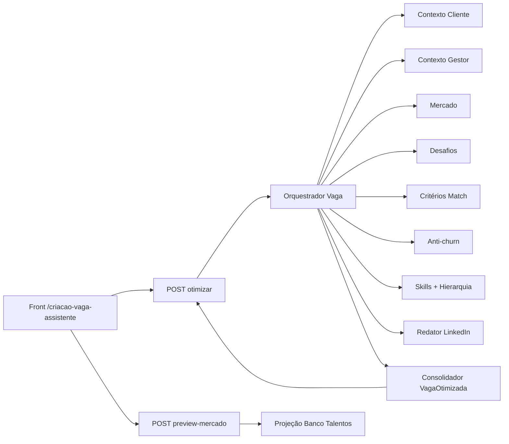

# Assistente de criação de vaga – Documentação Técnica (Regras de Negócio e Backend)

Documentação **multi-audiência** do protótipo **Assistente de criação de vaga** no hub Fourmakers: otimização de vagas com IA (formulário guiado ou prompt), geração de contexto, desafios, critérios de aderência, anti-churn, preview público editável e encadeamento para **Análise de aderência**.

**Criado em:** 02/06/2026  
**Última atualização:** 02/06/2026 — backlog de agentes e skills (time IA): pipeline, contratos de entrada/saída e priorização P0–P2.

**Estado:** protótipo front com mocks; integração API .NET 8 **pendente**.

---

## §0. Como usar este documento (mapa de audiências)

| Audiência | Secções prioritárias | Uso |
|-----------|---------------------|-----|
| **Recrutador / R&S** | §1–§3, §5, §9 | Criar e publicar vagas otimizadas |
| **Negócio / PO** | §1, §4, Bloco A §2 e §5 | Regras, jornada, aceite |
| **Frontend** | §6, §7, §8, §13 | Implementação no hub |
| **Backend .NET 8** | Bloco A §10–§11, §7, **Sugestões para integração** | Contratos, envelope, DTOs |
| **QA** | §8, §9 | Casos manuais e `data-testid` |
| **UX / Design** | §5 | DS, drawer preview, tabs |
| **IA (RAG)** | §10 | Chunks e sinónimos |
| **Time IA / Agentes** | **§14**, §7, Sugestões integração | Backlog de agentes, skills, I/O estruturado |

---

## §1. Visão geral e objetivo

### 1.1 Produto

| Item | Descrição |
|------|-----------|
| **Rota (protótipo)** | `/criacao-vaga-assistente` |
| **Registo hub** | `id: criacao-vaga-assistente` em `src/prototipo/registry.ts` |
| **Título na UI** | Assistente de criação de vaga |
| **Descrição (card)** | Otimize vagas com IA (formulário ou prompt): contexto, desafios, hierarquia de match, anti-churn e critérios para Análise de aderência. |
| **Persona** | Recrutador / analista de R&S / gestor de vaga |
| **Objetivo de negócio** | Reduzir tempo de abertura de vaga, alinhar critérios ao perfil do gestor e ao mercado, antecipar match no banco de talentos e encadear triagem em **Análise de aderência** após publicação. |

### 1.2 Objetivos principais (visão de produto)

- Estruturar vagas com **IA** a partir de formulário (perfil de atuação) ou **prompt** em linguagem natural.
- Exigir **cliente** e **gestor** em qualquer modo de entrada.
- Gerar **contexto** cliente/gestor, momento de mercado, desafios, objetivos, insights de triagem e recomendações **anti-churn**.
- Definir **hierarquia de match** (desafio / contexto / skills) e **≥6 critérios** para Análise de aderência.
- Oferecer **preview** da vaga pública (formato LinkedIn + desafios) com KPIs de mercado recalculáveis ao editar.
- Simular **publicação** e redirecionar para `/analise-aderencia`.

---

## §2. Jornada do utilizador

1. Aceder ao hub → card **Assistente de criação de vaga** ou rota `/criacao-vaga-assistente`.
2. **Setup:** selecionar **Cliente** e **Gestor** (obrigatório em ambos os modos).
3. Escolher modo (abas):
   - **Prompt com IA** (default, à esquerda): texto ≥ 40 caracteres.
   - **Formulário guiado:** título, modelo de trabalho (remoto/híbrido/presencial), contexto breve.
4. Clicar **Otimizar vaga com IA**.
5. **Processamento:** etapas simuladas (`ProcessamentoOtimizacaoVaga`).
6. **Resultados:** score de qualidade, contextos, hierarquia, desafios, objetivos, insights, anti-churn, tabela de critérios, skills.
7. **Preview da vaga** → drawer lateral:
   - KPIs: média aderência prevista, banco ≥80%, talentos similares.
   - Edição inline (título, descrição LinkedIn, desafio, desafios detalhados, localização) recalcula KPIs (mock).
   - **Publicar vaga** → box de sucesso abaixo de “Desafios detalhados” + scroll automático ao fim.
   - **Analisar aderentes** → `/analise-aderencia`.
8. **Nova otimização** repõe o fluxo.

---

## §3. Funcionalidades detalhadas (checklist de produto)

| Funcionalidade | Comportamento (protótipo) |
|----------------|---------------------------|
| Cliente / gestor | Selects mock acima das abas; estado partilhado `EntradaFormularioVaga`. |
| Aba Prompt com IA | Default; placeholder orienta perfil e objetivos. |
| Aba Formulário guiado | Título, modelo trabalho, contexto breve (placeholder inclui habilidades). |
| Validação CTA | Prompt: cliente + gestor + ≥40 chars. Form: cliente + gestor + título + modelo. |
| Processamento | Timer simulado; sem HTTP. |
| Resultado otimizado | `buildVagaOtimizadaMock(modo, form, prompt)`. |
| Hierarquia match | Pesos 40% / 35% / 25% com `Progress`. |
| Critérios aderência | Tabela ≥6 linhas com peso, desafio, evidência. |
| Preview drawer | `Sheet` + `ScrollArea`; edição com `prompt` nativo ou hover. |
| Recálculo mercado | `recalcularPreviewMercado` + banner informativo 6s. |
| Publicar | Estado `publicada`; scroll para confirmação; botões Analisar / Fechar. |
| Link hub | Breadcrumb + link para Análise de aderência. |

---

## §4. Regras de negócio

### 4.1 Críticas

| Regra | Detalhe |
|-------|---------|
| **Cliente obrigatório** | Bloqueia otimização sem seleção. |
| **Gestor obrigatório** | Bloqueia otimização sem seleção. |
| **Prompt mínimo** | ≥ 40 caracteres no modo prompt. |
| **Formulário mínimo** | Título não vazio + modelo de trabalho selecionado. |
| **Critérios para triagem** | Mínimo 6 critérios derivados dos desafios (mock fixo). |
| **Publicação** | Simulada; não gera URL pública real nem copia link. |
| **Pós-publicação** | CTA principal leva a Análise de aderência (vaga “já publicada” no protótipo). |

### 4.2 Preview e mercado (protótipo)

- KPIs são **simulados**; edições disparam variação pseudoaleatória em `recalcularPreviewMercado`.
- Mensagem de atualização some após 6 segundos.
- Sem persistência de rascunho entre sessões.

---

## §5. UX, UI e Design System

- **Layout:** `max-w-5xl`; header com gradiente `analise-brand-gradient` (reutiliza `analiseAderencia.css`).
- **Tabs:** `TabsList` 2 colunas — Prompt (esquerda, default) | Formulário (direita).
- **Componentes DS:** `Button`, `Card`, `Badge`, `Select`, `Tabs`, `Sheet`, `ScrollArea`, `Progress`, `Label`, `Input`, `Textarea`.
- **Tokens:** `primaryText`, `secondaryText`, `accent`, `borderSoft`, `successSoft`, `warningSoft` — sem cores hex soltas.
- **Acessibilidade:** `SheetTitle`/`SheetDescription`; `aria-label` em botões de edição; `role="status"` no banner de recálculo.
- **Estados:** avisos de validação (cliente, gestor, prompt curto); loading no processamento; drawer com scroll forçado após publicar.

---

## §6. Arquitetura frontend (protótipo)

```
src/prototipo/registry.ts
  └── CriacaoVagaAssistentePage.tsx
        ├── EntradaCriacaoVagaPanel (+ podeOtimizarVaga)
        ├── ProcessamentoOtimizacaoVaga
        └── ResultadoVagaOtimizada
              └── VagaPublicaPreviewDrawer
                    └── PreviewEditableSection
mocks/
  └── otimizarVagaMock.ts → buildVagaOtimizadaMock
utils/
  ├── linkedinDescricaoVaga.ts
  └── recalcularPreviewMercado.ts
types.ts
analiseAderencia.css (estilos partilhados)
```

**Próximo passo integração:** `POST /api/recrutamento/vagas/otimizar` + `POST .../publicar` + polling; substituir mocks; alinhar clientes/gestores a APIs reais.

---

## §7. Integração backend (consumida ou sugerida)

| Método | Path (sugerido) | Uso |
|--------|-----------------|-----|
| GET | `/api/recrutamento/clientes` | Lista clientes da org |
| GET | `/api/recrutamento/gestores?clienteId=` | Gestores por cliente |
| POST | `/api/recrutamento/vagas/otimizar` | IA: form ou prompt → `VagaOtimizadaResultado` |
| POST | `/api/recrutamento/vagas/{vagaId}/preview-mercado` | Recálculo KPIs após edição |
| POST | `/api/recrutamento/vagas/{vagaId}/publicar` | Publicação real |

Detalhes, JSON com envelope e DTOs C# na secção **Sugestões para integração**.

---

## §8. QA — `data-testid` sugeridos e casos manuais

| `data-testid` | Elemento |
|---------------|----------|
| `criacao-vaga-cliente` | Select cliente |
| `criacao-vaga-gestor` | Select gestor |
| `criacao-vaga-tab-prompt` | Aba prompt |
| `criacao-vaga-tab-formulario` | Aba formulário |
| `criacao-vaga-otimizar` | CTA principal |
| `criacao-vaga-resultado-score` | Score qualidade |
| `criacao-vaga-preview-abrir` | Botão preview |
| `criacao-vaga-publicar` | Publicar no drawer |
| `criacao-vaga-confirmacao` | Box sucesso |
| `criacao-vaga-analisar-aderentes` | Link pós-publicação |

**Casos manuais:**

1. Tentar otimizar sem cliente → CTA desabilitado + aviso.
2. Prompt com 39 chars → aviso de mínimo 40.
3. Form sem modelo → CTA desabilitado.
4. Fluxo completo prompt → resultados → preview → publicar → scroll mostra confirmação.
5. Editar título no preview → banner de recálculo de KPIs.
6. Analisar aderentes → navega para `/analise-aderencia`.

---

## §9. FAQ

| Ação / dúvida | Resposta |
|---------------|----------|
| Preciso preencher cliente no prompt? | Sim. Cliente e gestor são obrigatórios nos dois modos (selects acima das abas). |
| Qual aba abre por defeito? | **Prompt com IA** (primeira à esquerda). |
| A publicação é real? | Não no protótipo; simula sucesso e habilita ir à Análise de aderência. |
| Os KPIs do preview são reais? | Não; mock com variação ao editar campos. |
| Quantos critérios gera? | 6 no mock, alinhados aos desafios da vaga. |
| Integra com Perfil de atuação? | Conceitualmente sim (formulário guiado); APIs ainda sugeridas. |

---

## §10. Consumo por IA (RAG)

**Chunks sugeridos:** jornada §2, regras §4, endpoints §7, FAQ §9.  
**Sinónimos:** criação de vaga, otimizar vaga, anti-churn, match perfeito, preview LinkedIn, publicar vaga.  
**Limitações:** mocks fixos; sem `vagaId` persistido; gestores/clientes hardcoded.

---

## §11. Stakeholders / métricas (opcional)

| Stakeholder | Interesse |
|-------------|-----------|
| R&S | Tempo de abertura de vaga, qualidade do texto |
| Gestor | Alinhamento de critérios e desafios |
| Produto | Taxa de uso do encadeamento → Análise de aderência |

Métricas futuras: % vagas otimizadas via prompt vs form; score médio; cliques em Analisar aderentes pós-publicação.

---

## §12. Evoluções e dívidas técnicas

- Integrar listas reais de cliente/gestor (API).
- Substituir `prompt()` nativo por modal DS para edições no preview.
- Persistir rascunho e `vagaId` após otimizar.
- Paginação server-side de talentos similares no preview.
- `data-testid` nos componentes (hoje sugeridos apenas na doc).
- Testes E2E Playwright.
- Implementar agentes §14 (substituir mocks).

---

## §14. Backlog de agentes e skills (time IA)

Secção **obrigatória para o time de IA Fourmakers**: catálogo de agentes sugeridos para substituir mocks e orquestrar o fluxo de **criação/otimização de vaga** com retorno **JSON tipado**, versionável e escalável (jobs assíncronos + polling).

### 14.1 Princípios de arquitetura

| Princípio | Descrição |
|-----------|-----------|
| **Orquestrador único** | Um agente coordena o pipeline; agentes especializados são **tools/skills** invocáveis. |
| **Saída estruturada** | Cada agente devolve JSON validado por schema (JSON Schema / Pydantic / contrato C#). |
| **Idempotência** | `jobId` + `vagaRascunhoId` para reprocessamento e auditoria. |
| **Rastreabilidade** | `traceId`, `agentId`, `versaoPrompt`, `dataCriacao` em cada etapa. |
| **Envelope HTTP** | API .NET expõe envelope padrão; agentes comunicam via serviço interno ou fila. |



### 14.2 Catálogo de agentes (resumo)

| ID | Agente | Prioridade | Etapa UI |
|----|--------|------------|----------|
| `vaga-orquestrador` | Orquestrador de otimização de vaga | **P0** | Processamento |
| `vaga-contexto-cliente` | Analista de contexto do cliente | **P0** | Resultado — contexto cliente |
| `vaga-contexto-gestor` | Analista de perfil do gestor | **P0** | Resultado — contexto gestor |
| `vaga-mercado` | Analista de momento de mercado | **P1** | Resultado — mercado |
| `vaga-desafios` | Estruturador de desafios da posição | **P0** | Desafios + texto consolidado |
| `vaga-criterios-match` | Definidor de critérios de aderência | **P0** | Tabela ≥6 critérios |
| `vaga-anti-churn` | Consultor anti-churn / retenção | **P1** | Secção anti-churn |
| `vaga-skills-hierarquia` | Curador de skills e pesos de match | **P1** | Skills + hierarquia 40/35/25 |
| `vaga-redator-publico` | Redator vaga pública (LinkedIn) | **P1** | Preview — descrição |
| `vaga-preview-mercado` | Projeção banco de talentos | **P2** | KPIs preview |
| `vaga-validador-publicacao` | Validador pré-publicação | **P2** | Publicar vaga |

### 14.3 Skills transversais (biblioteca)

| Skill ID | Nome | Uso |
|----------|------|-----|
| `skill-llm-estruturado` | LLM com output JSON schema | Todos os agentes de texto |
| `skill-rag-cliente` | RAG cadastro cliente + histórico vagas | Contexto cliente |
| `skill-rag-gestor` | RAG perfil gestor + vagas fechadas | Contexto gestor |
| `skill-rag-mercado` | RAG benchmarks salário/oferta (org ou externo) | Mercado + preview |
| `skill-taxonomia-skills` | Ontologia hard/soft skills Fourmakers | Skills sugeridas |
| `skill-match-framework` | Framework Desafio/Match (pesos 40/35/25) | Critérios + hierarquia |
| `skill-pii-mascara` | Mascaramento PII em logs | Pipeline inteiro |
| `skill-versao-contrato` | Validação schema v1/v2 | Saída de cada agente |

### 14.4 Detalhamento por agente

#### `vaga-orquestrador` (P0)

| Campo | Valor |
|-------|--------|
| **Responsabilidade** | Receber entrada (form/prompt), invocar agentes em DAG, consolidar `VagaOtimizadaResultado`, calcular `scoreQualidade`. |
| **Skills** | `skill-llm-estruturado`, orquestração workflow, retry/timeout |
| **Invocação** | Interno (worker) após `POST /api/recrutamento/vagas/otimizar` |

**Entrada:**

```json
{
  "jobId": "job-vaga-001",
  "modoEntrada": "prompt",
  "clienteId": "cli-onesys",
  "gestorId": "gest-carlos",
  "tituloVaga": null,
  "modeloTrabalho": null,
  "contextoBreve": null,
  "promptTexto": "…",
  "orgId": "org-fourmakers"
}
```

**Saída:** objeto completo `VagaOtimizadaDto` (ver §11) + metadados:

```json
{
  "vagaRascunhoId": "v-draft-8821",
  "scoreQualidade": 91,
  "agentTrace": [{ "agentId": "vaga-contexto-cliente", "duracaoMs": 1200 }],
  "dataCriacao": "2026-06-02T18:00:00Z"
}
```

---

#### `vaga-contexto-cliente` (P0)

| Campo | Valor |
|-------|--------|
| **Responsabilidade** | Sintetizar contexto organizacional do cliente (squads, pressões, setor, compliance). |
| **Skills** | `skill-rag-cliente`, `skill-llm-estruturado` |

**Entrada:** `{ "clienteId", "orgId", "promptTexto?", "contextoBreve?" }`  
**Saída:** `{ "contextoCliente": "string", "confianca": 0.0-1.0, "fontes": ["crm", "rag"] }`

---

#### `vaga-contexto-gestor` (P0)

| Campo | Valor |
|-------|--------|
| **Responsabilidade** | Perfil de expectativa do gestor, histórico de contratações, fit cultural. |
| **Skills** | `skill-rag-gestor`, `skill-llm-estruturado` |

**Entrada:** `{ "gestorId", "clienteId", "tituloVaga?" }`  
**Saída:** `{ "contextoGestor": "string", "sinaisRetencao": ["…"], "confianca": 0.92 }`

---

#### `vaga-mercado` (P1)

| Campo | Valor |
|-------|--------|
| **Responsabilidade** | Momento de mercado, faixa salarial indicativa, escassez de perfil. |
| **Skills** | `skill-rag-mercado`, `skill-llm-estruturado` |

**Entrada:** `{ "tituloSugerido", "clienteId", "modeloTrabalho", "skillsSugeridas[]?" }`  
**Saída:** `{ "momentoMercado": "string", "faixaSalarialReferencia?": "string" }`

---

#### `vaga-desafios` (P0)

| Campo | Valor |
|-------|--------|
| **Responsabilidade** | Lista 5–8 desafios acionáveis + `textoDesafioConsolidado` para vaga pública. |
| **Skills** | `skill-match-framework`, `skill-llm-estruturado` |

**Entrada:** contextos cliente/gestor + prompt/form  
**Saída:**

```json
{
  "desafios": ["Governar design system…", "…"],
  "objetivos": ["Entregar em 90 dias…"],
  "textoDesafioConsolidado": "A posição em…"
}
```

---

#### `vaga-criterios-match` (P0)

| Campo | Valor |
|-------|--------|
| **Responsabilidade** | Gerar **≥6** critérios com `id`, `nome`, `peso` (1–5), `desafioVaga`, `evidenciaEsperada` — insumo direto da **Análise de aderência**. |
| **Skills** | `skill-match-framework`, `skill-llm-estruturado` |

**Saída:**

```json
{
  "criteriosAderencia": [
    {
      "id": "ds",
      "nome": "Sistemas de Design",
      "peso": 5,
      "desafioVaga": "Governar DS multi-squad",
      "evidenciaEsperada": "Cases de governança"
    }
  ]
}
```

---

#### `vaga-anti-churn` (P1)

| Campo | Valor |
|-------|--------|
| **Responsabilidade** | Recomendações de triagem e retenção (12 meses), alertas de perfil de risco. |
| **Skills** | `skill-rag-gestor`, histórico churn plataforma, `skill-llm-estruturado` |

**Saída:** `{ "antiChurn": ["…"], "pdiOrganizacional?": "string" }`

---

#### `vaga-skills-hierarquia` (P1)

| Campo | Valor |
|-------|--------|
| **Responsabilidade** | Skills hard/soft com nível e flag `relevante`; hierarquia de pesos (soma 100%). |
| **Skills** | `skill-taxonomia-skills`, `skill-match-framework` |

**Saída:**

```json
{
  "skillsSugeridas": [{ "nome": "Design System", "tipo": "hard", "relevante": true, "nivel": "Avançado" }],
  "hierarquiaMatch": [
    { "label": "Desafio da vaga", "peso": 40, "descricao": "…" }
  ],
  "insightsTriagem": ["Priorize candidatos com…"]
}
```

---

#### `vaga-redator-publico` (P1)

| Campo | Valor |
|-------|--------|
| **Responsabilidade** | Gerar `descricaoLinkedin` (formato seções About/Responsibilities/Requirements). |
| **Skills** | `skill-llm-estruturado`, template LinkedIn |

**Entrada:** `VagaOtimizada` parcial (título, desafios, skills, localização)  
**Saída:** `{ "descricaoLinkedin": "string", "tituloSugerido?": "string" }`

---

#### `vaga-preview-mercado` (P2)

| Campo | Valor |
|-------|--------|
| **Responsabilidade** | KPIs: `mediaAderenciaPrevista`, `talentosBancoAcima80`, `talentosQualificadosSimilares`. |
| **Skills** | `skill-rag-mercado`, motor de scoring banco talentos (SQL/vector) |

**Endpoint dedicado:** `POST /api/recrutamento/vagas/{vagaRascunhoId}/preview-mercado`  
**Entrada:** campos editados no preview (título, descrição, desafios)  
**Saída:** `PreviewMercadoVaga` (ver §11)

---

#### `vaga-validador-publicacao` (P2)

| Campo | Valor |
|-------|--------|
| **Responsabilidade** | Checklist: critérios ≥6, desafio consolidado, campos obrigatórios; bloqueia publicação se inválido. |
| **Skills** | validação schema, regras negócio |

**Saída:** `{ "aptoPublicar": true, "erros": [] }`

### 14.5 Mapeamento agente → endpoint .NET

| Endpoint | Agentes envolvidos |
|----------|-------------------|
| `POST …/vagas/otimizar` | Orquestrador + P0/P1 (DAG completo) |
| `POST …/vagas/{id}/preview-mercado` | `vaga-preview-mercado` (+ re-score leve) |
| `POST …/vagas/{id}/publicar` | `vaga-validador-publicacao` + persistência |

### 14.6 Backlog sugerido (sprints)

| Sprint | Entrega |
|--------|---------|
| **S1** | P0: orquestrador, contexto cliente/gestor, desafios, critérios |
| **S2** | P1: mercado, anti-churn, skills/hierarquia, redator LinkedIn |
| **S3** | P2: preview mercado real + validador publicação |
| **S4** | Observabilidade, feedback humano, versionamento prompts |

### 14.7 Contrato C# — metadados de agente (sugerido)

```csharp
public sealed class AgentExecutionTraceDto
{
    public string AgentId { get; set; }
    public string Versao { get; set; }
    public int DuracaoMs { get; set; }
    public double Confianca { get; set; }
}

public sealed class VagaOtimizadaAgentPayloadDto
{
    public VagaOtimizadaDto Resultado { get; set; }
    public List<AgentExecutionTraceDto> AgentTrace { get; set; }
}
```

---

## §13. Referências

- `PROTOTIPACAO.md` — hub e registo de rotas
- `public/design-toolkit.md` — DS e tokens
- `docs/ORIENTACAO_DOCUMENTACAO_TECNICA_PROTOTIPOS_EXTERNOS.md`
- `docs/ANALISE_ADERENCIA_DOCUMENTACAO_TECNICA.md` — fluxo downstream (§14 agentes de triagem)
- Código: `src/prototipo/criacao-vaga-assistente/`, `src/prototipo/pages/CriacaoVagaAssistentePage.tsx`

---

# Bloco A — Alinhamento ao guia externo

## 1. Título e metadados

Ver cabeçalho deste ficheiro (**Criado em** / **Última atualização**).

## 2. Visão geral e objetivo

Ver §1.

## 3. Parâmetros de entrada e contexto

| Parâmetro | Origem | Obrigatório |
|-----------|--------|-------------|
| `cliente` | Select (mock) | Sim |
| `gestor` | Select (mock) | Sim |
| `modoEntrada` | `formulario` \| `prompt` | Sim |
| `tituloVaga`, `modeloTrabalho`, `contextoBreve` | Form | Sim (modo form) |
| `promptTexto` | Textarea | Sim (modo prompt, ≥40) |
| Auth | Bearer (produção) | Sim |

## 4. Padrões de contratos do projeto (consistência)

| Aspecto | Padrão |
|---------|--------|
| Nomenclatura JSON | camelCase |
| Envelope | `retorno`, `sucesso`, `mensagem`, `erros` |
| Datas | `dataCriacao`, `dataAlteracao` |
| Colaborador | `codigoInternoColaborador` |
| Auth | `Authorization: Bearer {token}` |

Exemplo de envelope:

```json
{
  "retorno": {},
  "sucesso": true,
  "mensagem": null,
  "erros": null
}
```

## 5. Regras de negócio

Ver §4.

## 6. Fluxos por persona

**Recrutador:** setup → otimizar → rever resultado → preview → publicar → analisar aderentes.

## 7. Funcionalidades, UX e eventos

| Estado | Comportamento |
|--------|---------------|
| Loading | `ProcessamentoOtimizacaoVaga` |
| Vazio / inválido | CTA desabilitado + mensagens |
| Sucesso | Resultados + drawer |
| Erro API | Não implementado (exibir envelope na integração) |

## 8. Regras de sucesso, erro e bloqueios (UX)

| Cenário | UX |
|---------|-----|
| Sem cliente | “Selecione o cliente para continuar.” |
| Sem gestor | “Selecione o gestor da vaga para continuar.” |
| Prompt curto | “Escreva pelo menos 40 caracteres…” |
| Falha otimização (futuro) | Toast + `mensagem` / `erros` do envelope |

## 9. Linguagem e tom

Positivo, operacional, foco em match e retenção (“anti-churn”, “aderência prevista”).

## 10. APIs necessárias (backend .NET 8)

Todas marcadas **(sugerido)** — ver secção **Sugestões para integração**.

## 11. Modelos de dados

### `EntradaFormularioVaga` (front / request parcial)

| Propriedade | Tipo | Descrição |
|-------------|------|-----------|
| cliente | string | Nome ou id do cliente |
| gestor | string | Nome ou id do gestor |
| tituloVaga | string | Rascunho do título |
| modeloTrabalho | string | remoto \| hibrido \| presencial |
| contextoBreve | string | Contexto livre |

### `VagaOtimizadaResultado` (retorno principal)

| Propriedade | Tipo | Descrição |
|-------------|------|-----------|
| tituloSugerido | string | Título otimizado |
| scoreQualidade | number | 0–100 |
| previewMercado | PreviewMercadoVaga | KPIs |
| contextoCliente | string | Narrativa |
| contextoGestor | string | Narrativa |
| momentoMercado | string | Texto mercado |
| desafios | string[] | Lista |
| objetivos | string[] | Lista |
| insightsTriagem | string[] | Lista |
| antiChurn | string[] | Recomendações |
| hierarquiaMatch | array | label, peso, descricao |
| criteriosAderencia | CriterioMatchVaga[] | ≥6 |
| skillsSugeridas | SkillSugerida[] | hard/soft |
| textoDesafioConsolidado | string | Bloco único |
| pdiOrganizacional | string? | Opcional |

### `PreviewMercadoVaga`

| Propriedade | Tipo |
|-------------|------|
| mediaAderenciaPrevista | number |
| talentosBancoAcima80 | number |
| talentosQualificadosSimilares | number |
| vagasSimilaresReferencia | string |

## 12. Dependências de APIs e dados existentes

- Cadastro de **clientes** e **gestores** (CRM ou módulo recrutamento).
- Serviço de **IA** (otimização de texto e critérios).
- **Banco de talentos** / scoring para KPIs de preview (futuro).
- Vaga publicada consumida por **Análise de aderência**.

## 13. Fluxo resumido (backend)

1. Validar token e permissão (recrutador).
2. Validar cliente/gestor e payload conforme `modoEntrada`.
3. Executar pipeline IA → persistir rascunho de vaga.
4. Opcional: recalcular preview mercado ao editar campos.
5. Publicar → status publicada + `vagaId`.
6. Análise de aderência usa critérios/desafios da vaga.

## 14. Propostas de melhorias

- Wizard em passos (contexto → desafios → critérios → preview).
- Versionamento de rascunho.
- Sugestão de salário faixa mercado no resultado.

## 15. Cenários de erro e pontos de atenção

- Timeout de IA longo → job assíncrono (202 + polling).
- Gestor sem vínculo ao cliente → 400 com `erros`.
- Publicar sem otimizar antes → bloquear.

## 16. Resumo para o time

Protótipo navegável em `/criacao-vaga-assistente` com mocks; documentação pronta para backend implementar `otimizar` e `publicar` com envelope padrão; encadear com Análise de aderência. **Backlog de agentes:** ver **§14** (11 agentes + skills RAG cliente/gestor, match e redação LinkedIn).

## 17. Rodapé

- **Ficheiro:** `docs/CRIACAO_VAGA_ASSISTENTE_DOCUMENTACAO_TECNICA.md`
- **Encoding:** UTF-8
- **Download no hub:** `documentationMarkdownFile` no `registry.ts`; cópia em `public/docs/` via `npm run sync:prototipo-docs`

---

# Sugestões para integração

## POST `/api/recrutamento/vagas/otimizar` **(sugerido)**

**Auth:** Bearer  
**Body:** `application/json`

```json
{
  "modoEntrada": "prompt",
  "clienteId": "cli-onesys",
  "gestorId": "gest-carlos",
  "tituloVaga": null,
  "modeloTrabalho": null,
  "contextoBreve": null,
  "promptTexto": "Vaga UX sênior com design system..."
}
```

**Resposta 200:**

```json
{
  "retorno": {
    "vagaRascunhoId": "v-draft-8821",
    "dataCriacao": "2026-06-02T18:00:00Z",
    "tituloSugerido": "Senior UX/UI Designer — ONESYS",
    "scoreQualidade": 91,
    "previewMercado": {
      "mediaAderenciaPrevista": 78,
      "talentosBancoAcima80": 142,
      "talentosQualificadosSimilares": 38,
      "vagasSimilaresReferencia": "UX Sênior B2B SaaS (últimos 90 dias)"
    },
    "contextoCliente": "…",
    "contextoGestor": "…",
    "momentoMercado": "…",
    "desafios": ["…"],
    "objetivos": ["…"],
    "insightsTriagem": ["…"],
    "antiChurn": ["…"],
    "hierarquiaMatch": [
      { "label": "Desafio da vaga", "peso": 40, "descricao": "…" }
    ],
    "criteriosAderencia": [
      {
        "id": "ds",
        "nome": "Sistemas de Design",
        "peso": 5,
        "desafioVaga": "Governar DS multi-squad",
        "evidenciaEsperada": "Cases de governança"
      }
    ],
    "skillsSugeridas": [
      { "nome": "Design System", "tipo": "hard", "relevante": true, "nivel": "Avançado" }
    ],
    "textoDesafioConsolidado": "…",
    "pdiOrganizacional": "…"
  },
  "sucesso": true,
  "mensagem": null,
  "erros": null
}
```

**Erro 400:**

```json
{
  "retorno": null,
  "sucesso": false,
  "mensagem": "Não foi possível otimizar a vaga.",
  "erros": ["clienteId é obrigatório", "promptTexto deve ter no mínimo 40 caracteres"]
}
```

## POST `/api/recrutamento/vagas/{vagaRascunhoId}/publicar` **(sugerido)**

**Resposta 200:**

```json
{
  "retorno": {
    "vagaId": "v-pub-9901",
    "dataCriacao": "2026-06-02T18:05:00Z",
    "status": "publicada",
    "urlPublica": null
  },
  "sucesso": true,
  "mensagem": "Vaga publicada com sucesso.",
  "erros": null
}
```

## DTOs C# (sugeridos)

```csharp
public sealed class OtimizarVagaRequest
{
    public string ModoEntrada { get; set; }
    public string ClienteId { get; set; }
    public string GestorId { get; set; }
    public string TituloVaga { get; set; }
    public string ModeloTrabalho { get; set; }
    public string ContextoBreve { get; set; }
    public string PromptTexto { get; set; }
}

public sealed class VagaOtimizadaDto
{
    public string VagaRascunhoId { get; set; }
    public DateTime DataCriacao { get; set; }
    public string TituloSugerido { get; set; }
    public int ScoreQualidade { get; set; }
    public PreviewMercadoVagaDto PreviewMercado { get; set; }
    public List<CriterioMatchVagaDto> CriteriosAderencia { get; set; }
    // … demais campos alinhados ao JSON
}
```

## Condicionais

| Perfil | Comportamento |
|--------|----------------|
| Recrutador | Otimiza e publica vagas da carteira/org |
| Gestor | Pode ser destinatário (`gestorId`); leitura do resultado se autorizado |
| Comercial | Sem publicação por defeito (só leitura de preview, se aplicável) |

---

*Documentação do protótipo **Assistente de criação de vaga** — hub Fourmakers.*
